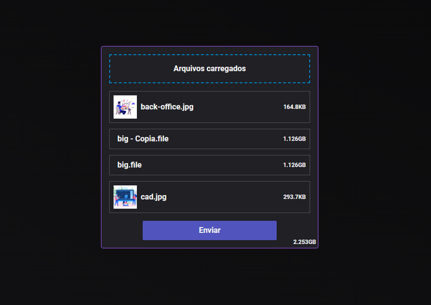

# Scalable Upload
API created without frameworks, made to handle files with **GIGABYTES** of data.

>## Project View

Example made to illustrate and upload of two files with 1GB each and some images, with a realtime feedback of the upload status.

>## How it works?
It works with a interface in React, handling the files, displaying then on screen, and making a HTTP POST Request with the files on a Form Data, and receiving the upload status through Socket.io by the same server. On server side we have a Busboy handling the node.js streams of the parsed files, and Pino showing the status of each phase on terminal while Socket.io send the status to client.

>## Technologies
- ### Frontend
  - [React](https://reactjs.org/)
  - [React Dropzone](https://react-dropzone.js.org/)
  - [React Circular Progressbar](https://github.com/kevinsqi/react-circular-progressbar)
  - [Socket.io Client](https://socket.io/docs/v4/client-api/)
- ### Backend
  - [Node](https://nodejs.org/en/about/)
  - [Busboy](https://github.com/mscdex/busboy)
  - [Pino](https://github.com/pinojs/pino)
  - [Socket.io Server](https://socket.io/docs/v4/server-api/)

>## How to run
```bash
  # Clone repository
  git clone https://github.com/Mist3rBru/scalable-upload.git;

  # Access project
  cd scalable-upload; 

  # Run App
  ## With Docker
  docker-compose up;

  ## OR on both folders
  npm install; # Install dependencies
  npm run dev; # Run app on development environment

  # Access page on http://localhost:3000

```


